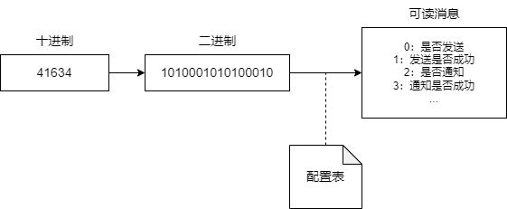

# 测试Baidu Compat编写rust工具的能力

## 背景

测试目的：

- 测试Baidu Compat在代码生成方面的能力。
- 学习rust语言。

测试方式：

- 编写一个rust工具，用于快速解析二进制bitFlag字段所代表的含义。
- 由Compat生成的代码或文字会有特殊的标识。

## 需求分析

在数据库字段中，总会存在使用二进制来判断一系列状态的情况。
但通常是显示为十进制数字，每次解读都需要将其转换为二进制，再逐位比较，才能搞明白各个状态。
因此本工具的功能十分简单，就是将二进制转换为十进制，并输出其含义。


本工具的主要功能为：

1. 根据输入的字段和字段值，解析出其含义。
2. 设置字段和字段每个bit的含义。
3. 更新字段和字段每个bit的含义。
4. 美观的TUI界面。

## 工具设计

### 存储方案

本质是一个实现存储的Map，其key为字段名，value为字段值。
value值很复杂，通常是对每个bit的含义进行描述。
例如第几位是什么含义。

对此数据的读取和存储是工具的核心内容。
而说到数据存储，自然而然会有以下方案**【Compat生成】**：

| **方式**    | **优点** | **缺点** |
|:---------:|:------:|:------:|
| **文件存储**  | 1. 易于实现和理解。</br>2. 不需要额外的数据库软件或服务。</br>3. 灵活性高，可以存储任意格式的数据。       | 1. 访问速度慢，尤其是处理大量数据时。</br>2. 数据结构不易查询，除非通过编写复杂的解析程序。</br>3. 数据安全性和完整性难以保证，容易出现数据丢失或损坏。</br>4. 难以支持并发访问和事务处理。       |
| **数据库存储** | 1. 数据结构化和规范化，便于查询和管理。</br>2. 支持复杂的数据操作，如索引、排序、聚合等。</br>3. 数据安全性和完整性高，支持事务处理。</br>4. 易于实现数据的并发访问和共享。       | 1. 需要安装和维护数据库软件或服务。</br>2. 数据库设计需要一定的专业技能。</br>3. 对于非结构化数据的存储和查询可能不够灵活。</br>4. 在高并发场景下，性能可能受到限制。       |
| **内存存储**  | 1. 访问速度极快，适合需要高性能的场景。</br>2. 易于实现并发访问和共享。</br>3. 无需磁盘I/O操作，减少系统延迟。       | 1. 数据易失性高，一旦程序或系统崩溃，数据可能会丢失。</br>2. 容量受限，无法存储大量数据。</br>3. 需要定期将数据持久化到磁盘，增加系统复杂性。</br>4. 难以保证数据的安全性和完整性，除非配合其他机制。       |

对于一个小工具，数据库肯定是不需要的，内存存储不能保存数据，对于命令行工具，文件存储是最佳选择。

### 文件内容

在数据格式上设计上，也有几种方式可以选择：

- csv文件：类似数据库，可读性良好，但字段值是大段的文字，不易阅读。
- json文件：可读性也可以，字段值可以通过数组进行配置，也还行。

选择json文件最重要的原因时，对于大量字段配置文件，json格式可以很好的进行配置，直接复制粘贴。(csv也不是不行)

```json
{
    "key": [
        "第0位含义",
        "第1位含义",
        ...
    ]
}
```

## 工具实现

### 第三方库

```bash
cargo add serde_json
```

### 创建项目【Compat生成】

1. 打开终端：打开你的命令行界面。

运行cargo new命令：使用cargo new命令加上你的项目名称来创建一个新的项目。例如，要创建一个名为hello_world的项目，你可以运行：

```bash
cargo new hello_world
```

这个命令会创建一个新的目录hello_world，并在其中设置一个新的Rust项目。这个目录包含以下文件和目录：

- Cargo.toml：项目的配置文件，用于描述项目的依赖和元信息。
- src/：包含Rust源代码的目录。
- src/main.rs：Rust程序的入口点。对于库项目，这个文件将被命名为lib.rs。

进入项目目录：创建项目后，使用cd命令进入项目目录：

```bash
cd hello_world
```

构建和运行项目：在项目目录中，你可以使用cargo build命令来构建项目，使用cargo run命令来运行项目。对于我们的hello_world项目，运行cargo run将打印出默认的"Hello, world!"消息。

```bash
cargo run
```

这将自动编译你的Rust代码（如果它是第一次运行或自上次编译以来有所更改），并运行编译后的程序。

### 文件读取

```rust
// 异步函数，用于读取目录中的所有JSON文件并解析它们
async fn read_json_in_dir(path: &Path) -> Result<Data, Box<dyn std::error::Error>> {
    let mut datas = HashMap::new();
    // 使用tokio::fs::read_directory_entry来异步读取目录项
    let mut stream = tokio::fs::read_dir(path).await?;

    while let Some(entry) = stream.next_entry().await? {
        let path = entry.path();

        if path.extension() == Some("json".as_ref()) {
            // 异步读取并解析JSON文件
            let data = read_and_parse_json_file(&path).await?;
            for (k, v) in data {
                datas.insert(k, v);
            }
        }
    }
    Ok(Data { data: datas })
}

async fn read_and_parse_json_file(path: &Path,) -> Result<HashMap<String, Vec<String>>, Box<dyn std::error::Error>> {
    let content = fs::read_to_string(path).await;
    match content {
        Ok(content) => {
            let data: HashMap<String, Vec<String>> = serde_json::from_str(&content)?;
            Ok(data)
        }
        Err(e) => {
            println!("{}", e);
            Err(Box::new(e))
        }
    }
}
```


